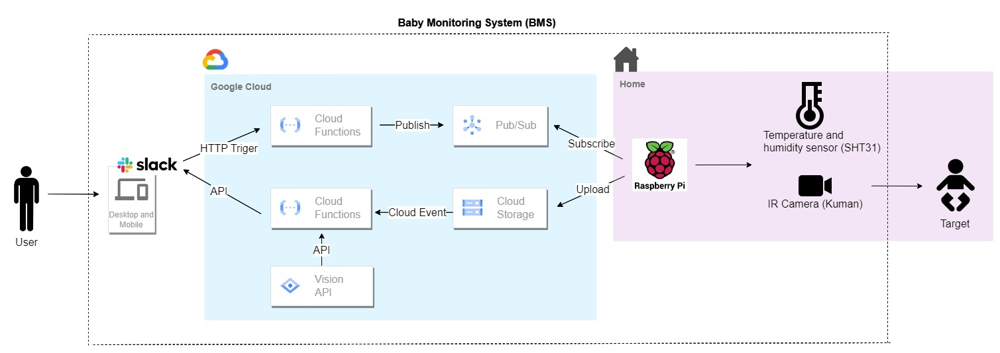
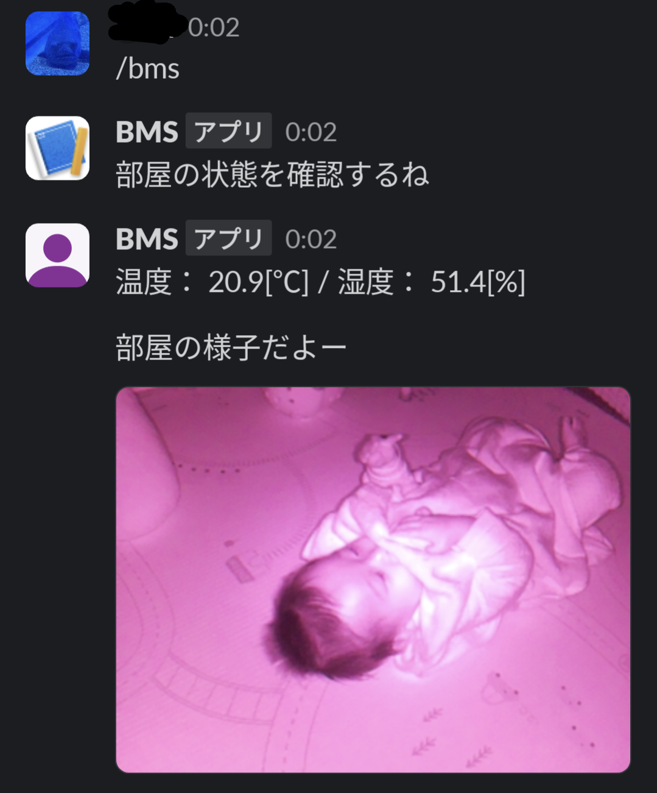
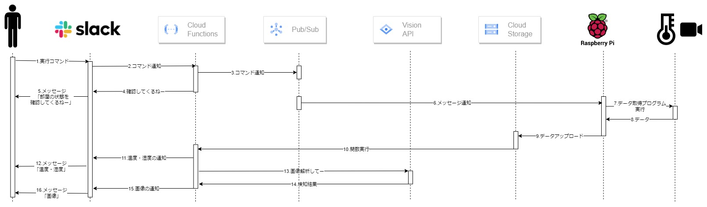

# Baby Monitoring System


## Overview
外出中でも赤ちゃんの様子を確認できるシステムです.<br>
Baby Monitoring Systemとしていますが、気になるときに対象の様子および温湿度をチェックできるシステムとして、様々な形に転用可能です.<br>
<br>


## Requirement
- 温湿度センサ
  - STH31
- カメラ
  - Kuman IR Camera
- Raspberry Pi
  - 上記カメラと温湿度センサを使うのであれば、I2C通信Pinとカメラ用FFCケーブル口があるタイプ

## Setup
### first step
`Setup Google Cloud`
- [Google Cloud Projectの作成](https://cloud.google.com/resource-manager/docs/creating-managing-projects?hl=ja)
  - プロジェクトIDの制約等に注意しながらプロジェクトを作成してください.
- Google Cloud SDKのダウンロードとインストール
  - [公式サイト](https://cloud.google.com/sdk/)にアクセスして、作業するPC(raspberry piでも可)のOSに合わせてインストーラーをダウンロードし、インストールしてください.
- gcloudの初期化
  - Terminal上で下記コマンドを実行し、アカウント認証やプロジェクトを選択してください.
```bash
$ gcloud init
```

`(Option)Use gcloud command on GitBash`
```bash
# Create .bashrc
$ touch ~/.bashrc
export PATH="$PATH:/c/Program Files (x86)/Google/Cloud SDK/google-cloud-sdk/bin"
alias gcloud="gcloud.cmd"

# Enable
$ source ~/.bashrc
```

### google-cloud/functions_slack_trigger
`Create Pub/Sub Topic and Subscriber`
```bash
$ gcloud pubsub topics create [TOPIC_NAME]
$ gcloud pubsub subscriptions create [SUBSCRIBER_NAME] --topic=[TOPIC_NAME]
```
[TOPIC_NAME],[SUBSCRIBER_NAME],[TOPIC_NAME]をご自身の環境に合わせて設定してください.

`Create Service Account`
```bash
$ gcloud iam service-accounts create [SERVICE_ACCOUNT_NAME] 
$ gcloud projects add-iam-policy-binding [PROJECT_ID] --member="serviceAccount:[SERVICE_ACCOUNT_NAME]@[PROJECT_ID].iam.gserviceaccount.com" --role="[ROLE]"
$ gcloud iam service-accounts keys create [FILE_NAME].json --iam-account [SERVICE_ACCOUNT_NAME]@[PROJECT_ID].iam.gserviceaccount.com
```
[SERVICE_ACCOUNT_NAME],[PROJECT_ID],[FILE_NAME],[SERVICE_ACCOUNT_NAME]をご自身の環境に合わせて設定してください.<br><br>
作成したサービスアカウントキーファイルをfunction_slack_triggerディレクトリ配下に置いてください.<br>
main.pyのKEY_PATHを[FILE_NAME]（＝サービスアカウントキーファイル）に設定してください.

`Deploy`
```bash
$ cd function_slack_trigger
$ gcloud functions deploy python-slack-function \
--gen2 \
--runtime=python39 \
--region=us-east1 \
--source=. \
--entry-point=slack_command \
--trigger-http \
--set-env-vars "GCP_PROJECT=[YOUR_PROJECT_ID],SLACK_SECRET=[YOUR_SLACK_SECRET],PUBSUB_TOPIC=[YOUR_TOPIC]" \
--allow-unauthenticated
```
[YOUR_PROJECT_ID],[YOUR_SLACK_SECRET],[YOUR_TOPIC]をご自身の環境に合わせて設定してください.

`Set Slack Slash Command`
<br>Slash CommandのRequest URLにデプロイしたcloud functions関数のURLを設定してください.<br>
詳細は[ドキュメント](https://cloud.google.com/functions/docs/tutorials/slack?hl=ja#functions-clone-sample-repository-python)などを参照してください.<br>


### google-cloud/functions_storage_upload
`Create Cloud Storage Bucket`
<br>米国リージョンは無料枠があるためus-east1に作成

`Set Slack Scope and Get TOKEN`
<br>OAuth Scopeにfiles:writeとchat:writeを追加してください.<br>
※Slackにアプリをインストール後、Slackの該当チャンネルから「アプリを追加する」を忘れないよう注意してください.

`Add roles to Cloud Storage Service Agent`
<br>CloudEvent trigger作成時にCloud StorageのサービスエージェントにPub/Subのパブリッシュ権限を付与してある必要があります.<br>
[YOUR_PROJECT_ID]を自身の環境に合わせて設定してください.
```bash
$ PROJECT_ID=[YOUR_PROJECT_ID]
$ SERVICE_ACCOUNT="$(gcloud storage service-agent --project=${PROJECT_ID})"   
$ gcloud projects add-iam-policy-binding ${PROJECT_ID} \
    --member="serviceAccount:${SERVICE_ACCOUNT}" \
    --role='roles/pubsub.publisher'
```

`Enable Cloud Vision API`
```bash
$ gcloud services enable vision.googleapis.com --project [YOUR_PROJECT_ID]
```

`Deploy`
<br>--regionは使用するCloud Storageバケットのリージョンに合わせてあります<br>
[YOUR_BUCKET_NAME],[YOUR_BOT_USER_OAUTH_TOKEN],[YOUR_SLACK_CHANNEL_ID]を自身の環境に合わせて設定してください

```bash
$ cd functions_storage_uploaded
$ gcloud functions deploy python-storage-function \
--gen2 \
--runtime=python39 \
--region=us-east1 \
--source=. \
--entry-point=process_file_upload \
--trigger-resource="[YOUR_BUCKET_NAME]" \
--trigger-event=google.storage.object.finalize \
--set-env-vars="SLACK_TOKEN=[YOUR_BOT_USER_OAUTH_TOKEN],SLACK_CHANNEL_ID=[YOUR_SLACK_CHANNEL_ID]"
```
<br>

※下記のようなエラーが発生する場合は必要なAPIが有効かされていない可能性があります.<br>

```bash
Invalid resource state for "": Permission denied while using the Eventarc Service Agent. If you recently started to use Eventarc, it may take a few minutes before all necessary permissions are propagated to the Service Agent. Otherwise, verify that it has Eventarc Service Agent role.
```

該当のAPIをgcloud services enableコマンドで有効化するか、少し時間をおいてから再度デプロイコマンドを実行してください.


### raspberry-pi
`Setup python virtual environment`
```bash
# Create
$ python -m venv [YOUR_VENV_NAME]

# Edit pyvenv.cfg to use picamera2 on the venv
$ vi [YOUT_VENV_NAMW]/pyvenv.cfg

home = /usr/bin
include-system-site-packages = true # ←falseからtrueに変更
version = 3.11.2
executable = /usr/bin/python3.11

# Enable venv
$ source [YOUR_VENV_NAME]/bin/activate
```
`Install packages`
```bash
$ cd raspberry-pi
$ pip install -r requirements.txt
```

`Run`
```bash
$ python main.py
```

<!-- 
`(Option)Auto Run`
<br>起動後にプログラムを自動実行するために以下を設定してください.<br>
```bash
$ crontab -e

# ファイルの最後に以下の行を追加
@reboot [YOUR_PATH]/boot.sh
```
権限を付与してください.
```bash
$ chmod +x boot.sh
```
-->


## Usage
Slackから設定したスラッシュコマンドを実行することで、結果が返ってきます.




## Features
### 機能概要
- Slack
    - ユーザとシステム間のインターフェース
    - 特定コマンドを実行すると、モニタリング状況を確認できる
- Google Cloud
    - クライアント(Slack)とエッジ(Raspberry Pi)との橋渡し
    - Slackからリクエストを受け取り、Raspberry Piへデータ取得をリクエストする
    - Raspberry Piからデータを受け取り、Slackへデータを送信する
    - ~~画像解析（Vision APIで赤ちゃん検知処理)も行うはずが~~ IRだからか上手く検知せず.改良予定
- Raspberry Pi
    - Google Cloudからデータ取得リクエストを受信し、センサ値・カメラ画像をGoogle Cloudへアップロードする


### シーケンス図  


### 機能一覧
| 機能           | 機能名           | 詳細                                                             |
|----------------|------------------|------------------------------------------------------------------|
| Slack          | データ表示       | 画像・温度・湿度といったデータを表示 |
| Google Cloud (Pub/Sub) | データ取得リクエストの送受信 | • クライアント（Slack）からリクエストを受信する<br>• エッジ（Raspberry Pi）へリクエストを送信する<br>• エッジ（Raspberry Pi）上でGoogle Cloudからリクエストを受信する |
| Google Cloud (Cloud Storage) | データアップロード | Raspberry PiのデータをGoogle Cloudへ送信                        |
| ~~Google Cloud (Cloud Vision API)~~ | ~~画像分析~~       | ~~赤ちゃんを検知する~~                                           |
| Google Cloud (Cloud Functions) | バックエンドサービス | SlackとGoogle Cloudの連携                                        |
| Raspberry Pi   | データ取得       | カメラと温湿度センサーからデータを取得する                         |

### 動機
Google Cloudの学習のため.<br>
そのため、処理はできるだけクラウド上で実施する構成を組みました.<br>
普通に使う分であればGoogleCloudは無料枠内で運用できる想定です.<br>
~~そもそもローカルで使うんであればRaspiだけでWebhookで動画配信したり、X飛ばしたりしたほうがモニタリングできるよね.~~


## Licence
MIT
